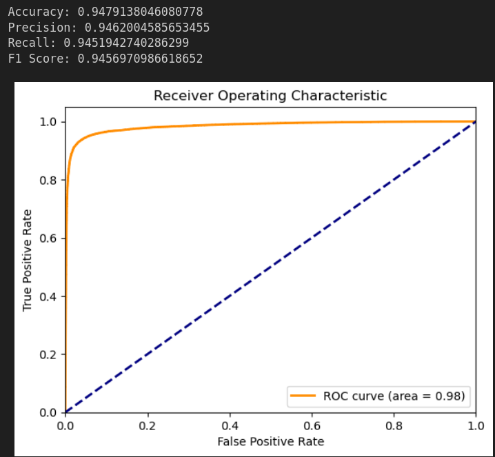
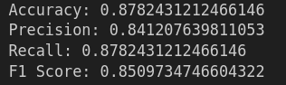
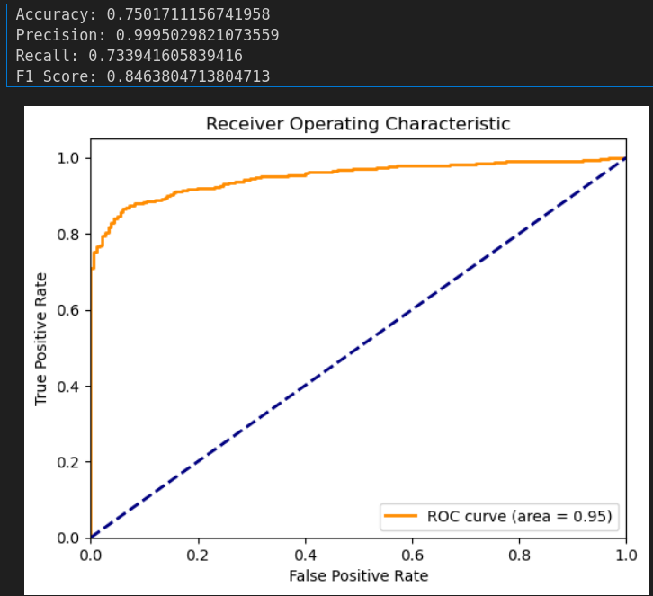
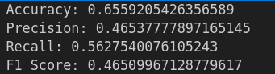

DGA botnets classification with BiLSTM

This code is implemented based on the paper [Adversarial Defense: DGA-Based Botnets and DNS
Homographs Detection Through Integrated
Deep Learning](https://ieeexplore.ieee.org/document/9377310)

# Evaluation

**In this demonstration, we train with only 1 epoch to save time.**

IDFC - Binaray class:

IDFC - Multiple class:

ADFC - Binaray class:

ADFC - Multiple class:

